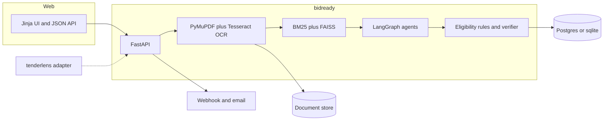
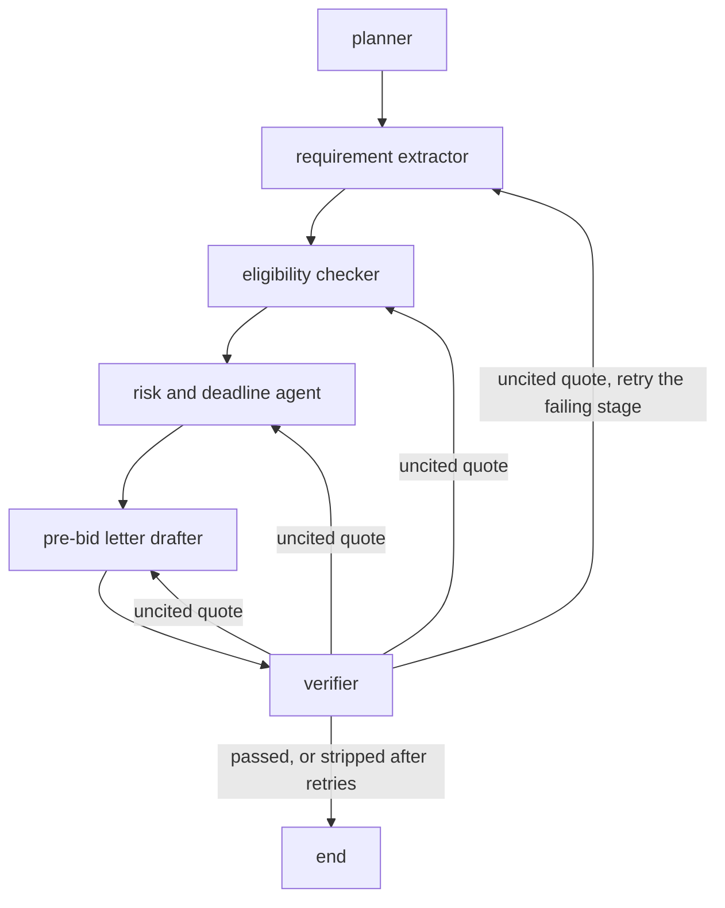
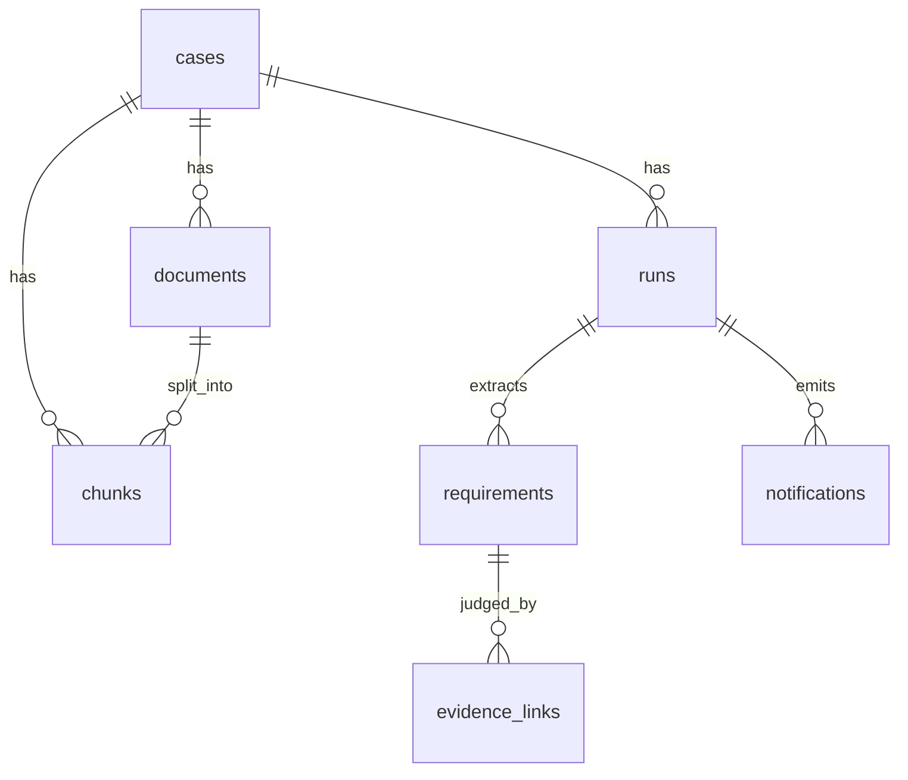

# bidready

Indian MSMEs lose government tenders because a pack runs 100 to 300 pages across scanned PDFs, corrigenda and annexures. Working out eligibility, and which certificate answers which clause, takes days. Consultants charge for that reading.

bidready takes a tender pack plus a company's own documents (GST certificate, turnover statements, past work orders, certifications) and writes four things:

1. A cited go / no-go eligibility report.
2. A compliance matrix that maps each extracted requirement to the company evidence that satisfies it, or marks it `MISSING`.
3. Risks and key deadlines (EMD, bid due date, pre-bid meeting, liquidated damages).
4. A draft pre-bid query letter.

Every claim cites a clause and a page. The draft is for a person to review. It is not legal advice and it is not a bid recommendation.

This repository is a public resume project. The company files under `src/bidready/synthetic/` are fictional.

## Architecture



The tenderlens adapter is optional. bidready runs with `TENDERLENS_BASE_URL` unset. The sibling crawler at `hiroshi-os/tenderlens` was only a README when this MVP was written, so the adapter speaks a small JSON contract and is not required for any scored path.

## Agent graph



State is a LangGraph `TypedDict`. Each node appends a trace event (`node`, milliseconds, detail). Retries are a dict on the state. A stage may be sent back at most twice. If one stage exceeds that, or the total retries exceed 6, the verifier deletes the unsupported claims and ends. The graph recursion limit is 50.

On the gold cases below, the mock provider passed the verifier on the first pass (964 of 964 claims). The retry edge is covered by `tests/test_pipeline.py`, which injects one fabricated quote and checks that the second pass cites a real line.

Mock mode does not call a model. It runs the same graph and applies the cue rules written in `src/bidready/prompts.py`. `openai` and `ollama` call a model for extraction, eligibility, risks and a question note, then fall back to those rules if the call fails or returns nothing. That fallback is recorded in the trace. The LLM path was not scored in the numbers below.

## Data model



| Table | What it stores |
| --- | --- |
| `cases` | One tender review. Status, synthetic `profile_id`, go / no-go. |
| `documents` | Tender or company file, storage URI, page count, OCR page count. |
| `chunks` | Layout chunk with page range, clause, section heading, text. |
| `runs` | Provider, model, embedding, reranker, prompt version, latency, token counts, full report JSON, trace. |
| `requirements` | Extracted clause, kind, quote, page, chunk id. |
| `evidence_links` | Decision (`met`, `not_met`, `missing`, `unclear`), obligation, rationale, evidence quote. |
| `notifications` | Webhook and email rows. `stubbed` when no URL or SMTP host is set. |

sqlite is the default for a laptop and for tests. Postgres is the database in `docker-compose.yml`.

## Design

### Parsing and chunking

Text PDFs are read with PyMuPDF `get_text("dict")` so each visual line stays a line. A page with fewer than 40 alphanumeric characters is rendered at 200 dpi and passed to Tesseract. On this gold set that fired for 8 pages of the 50-page SGGSCC pack and for none of the other nine PDFs.

Headings (`Clause 2. Earnest Money Deposit`, `NOTICE INVITING TENDER`) become the chunk's section and are not glued onto the next requirement. All-caps body text is common in these packs, so a line that contains `should`, `shall`, `rupees` or `lakh` stays in the body. A wrapped amount such as `(GROSS) OF 88 LAKHS` is joined to the line above. A new `BIDDER SHOULD` or `EMD` line is not.

Chunks flush on a page change and around 1000 characters (hard stop 1800). Each chunk keeps `page_start`, `page_end`, a clause number when the line starts with one, and the section heading.

### Retrieval

Four modes share one index:

| Mode | What it does |
| --- | --- |
| `vector` | FAISS `IndexFlatIP` on L2-normalised embeddings (cosine). |
| `bm25` | `rank_bm25` Okapi over word tokens. |
| `hybrid` | Reciprocal rank fusion of the two lists, `k = 60`. |
| `hybrid_rerank` | Fusion pool of up to 30 chunks, then a reranker cuts it to k. |

The default embedder is `hash`: a 384-dimensional feature hash of tokens. It is lexical. It is not a semantic model. It is the default so Docker and CI do not download weights. `EMBEDDING_PROVIDER=sentence-transformers` uses `all-MiniLM-L6-v2` after `pip install -e ".[local]"`. That provider was not installed for the measured run.

The default reranker is character-trigram Jaccard. `RERANKER=cross-encoder` loads `cross-encoder/ms-marco-MiniLM-L-6-v2` from the same local extra. That model was not measured.

Tradeoff. In-process FAISS avoids a second server. pgvector would be the better index once many tenants share one Postgres. On this gold set, with hash embeddings, fusion beat the vector index, and the lexical reranker lowered MRR relative to fusion alone. A cross-encoder might reverse that. It was not measured, so that sentence is a hypothesis, not a result.

### Eligibility and the verifier

The checker does not read a hidden profile JSON at decision time. It retrieves company chunks and reads the amount, headcount or certificate sentence it cites.

| Signal in the tender sentence | Decision rule |
| --- | --- |
| Turnover, solvency, net worth | Compare the cited evidence amount with the rupee threshold next to the keyword. A percent of estimated cost is `unclear` when no estimated cost was parsed. |
| Similar works | Parse alternatives such as "3 works of Rs. X" or "THREE SIMILAR WORKS ... 70 LAKHS". |
| GST, PAN, PSARA, ISO | `met` only when a company sentence contains the marker. |
| Blacklist, loss years | `met` when the cited sentence is the negative declaration. |
| EMD, bid security | A submission item. `missing` unless a company sentence cites an instrument. `missing` here is `CONDITIONAL`, not `NO-GO`. |

Go / no-go, which is not a legal opinion: any `not_met` is `NO-GO`. A `missing` qualification is `NO-GO`. A `missing` submission item or any `unclear` row is `CONDITIONAL`. All `met` is `GO`.

The verifier is programmatic. A quote is supported when it has at least 20 characters after whitespace normalisation and is a substring of the cited chunk (exact or whitespace-normalised). Periods in `Rs.` and `Mr.` are not sentence breaks, because splitting there used to drop the amount. The verifier does not ask a model whether a citation "seems" right.

## Eval methodology

Labels live in `evals/gold/manifest.json`, dated 2026-09-25. Ten public tender PDFs. The PDFs are not in git. `python -m evals.cli fetch` downloads them into `data/gold_pdfs/` and checks the sha256 in the manifest.

The label set was read while the heuristic was being written. These scores are not an unbiased estimate on unseen tenders.

| id | pages | source |
| --- | --- | --- |
| barc-ced-2026 | 17 | https://barc.gov.in/tenders/tender265.pdf |
| cci-forensic-2024 | 34 | https://www.cci.gov.in/images/whatsnew/en/nit-dated-24102024-11729760843.pdf |
| epi-1366 | 40 | https://epi.gov.in/admin/image/tenders/1741783038_NIT-1366.pdf |
| epi-1367 | 39 | https://epi.gov.in/admin/image/tenders/1741689388_NIT1367.pdf |
| igidr-travel-2024 | 15 | http://www.igidr.ac.in/tender/2024/TD-09.pdf |
| iiml-website | 17 | https://www.iiml.ac.in/sites/default/files/upload/tender/1620136915IIML_Website.pdf |
| iimtrichy-stp-2024 | 24 | https://www.iimtrichy.ac.in/sites/default/files/upload/14Oct2024193737_2024101419373324SP204T_STPPlant_Final.pdf |
| iitpkd-ambulance-2024 | 13 | https://iitpkd.ac.in/sites/default/files/2024-02/TENDER_DOCUMENT_399.pdf |
| sggscc-civil-2024 | 50 | https://www.sggscc.ac.in/uploads/tenders/tenderDocument/02da0157d53780863da33b98f4c446f0.pdf |
| nhm-dnh-2025 | 25 | https://cdnbbsr.s3waas.gov.in/s371e09b16e21f7b6919bbfc43f6a5b2f0/uploads/2025/11/202511132120554845.pdf |

sha256 values are in the manifest. NHM's first page names the Mission Director, National Health Mission, UT of Dadra & Nagar Haveli, Daman & Diu.

Company profiles `sample-civil` and `sample-security` are synthetic. Both files say so in the first line. GSTINs are fake. Eligibility labels say which profile should be `met`, `not_met`, `missing` or `unclear`.

What is scored:

- Retrieval recall@5, recall@10 and MRR for `vector`, `hybrid` and `hybrid_rerank`. A chunk is relevant when it contains every phrase in the query's `match_all`. 28 queries.
- Requirement extraction. A prediction matches a gold clause when the predicted sentence contains every gold phrase. Micro precision and recall. v1 and v2 are cue policies in the prompts, applied by the mock extractor. v1 scans every chunk. v2 also requires a modal (`shall`, `must`, `should`, `required`).
- Eligibility accuracy on the labelled clauses, against the two synthetic profiles. 39 labels.
- Citation faithfulness on the full pipeline: every tender quote, evidence quote, risk, deadline and letter quote must be a span of the stored chunk.
- Latency is wall clock around `analyse()` for each tender with `sample-civil`. Token counts are whatever the provider recorded.

The 33 gold requirements are selected clauses, not every requirement sentence in the packs. Precision counts any extra extracted sentence as a false positive, including real clauses that were never labelled. It is a lower bound against an exhaustive annotation. Recall asks whether those 33 clauses were extracted.

## Results

Measured 2026-09-25. Python 3.12.3, Linux 6.12.94+ x86_64, 4 CPUs, 15.64 GiB RAM. Tesseract 5.3.4. LLM provider `mock` (no model call). Embeddings `feature-hash-384`. Reranker `lexical-trigram-jaccard`. Prompt text sha256 prefixes: v1 `20b6de85dd7e`, v2 `2b80157d0c34`. Unrounded values are in `evals/results/measured.json`.

### Retrieval (28 queries)

| mode | recall@5 | recall@10 | MRR |
| --- | ---: | ---: | ---: |
| vector | 0.536 | 0.607 | 0.519 |
| hybrid | 0.680 | 0.883 | 0.685 |
| hybrid + lexical rerank | 0.608 | 0.854 | 0.525 |

Figures are rounded to three decimals from that JSON. Hybrid is the best of the three measured modes. The lexical reranker reduced MRR from 0.685 to 0.525.

`sentence-transformers` and the cross-encoder were not measured.

### Requirement extraction

| prompt | predicted sentences | labelled clauses matched | precision | recall | F1 |
| --- | ---: | ---: | ---: | ---: | ---: |
| v1 (35 cues, full document) | 549 | 33 / 33 | 0.060 | 1.000 | 0.113 |
| v2 (20 cues, modal required) | 191 | 30 / 33 | 0.157 | 0.909 | 0.268 |

v2 is stricter and misses 3 of the 33 labelled clauses. v1 is the default because it recalled every labelled clause on this set. The precision column is the one described above: most of the 549 sentences are real tender sentences that are not in the 33-clause label list.

### Eligibility

39 / 39 labelled decisions matched. Confusion is only the diagonal: `met` 19, `missing` 10, `not_met` 7, `unclear` 3. Profiles are synthetic.

### Citation faithfulness and latency

Full pipeline, `sample-civil`, mock provider. Faithfulness 964 / 964. Prompt tokens 0 and completion tokens 0 on every run, because mock mode does not call a model. Cost in rupees was not measured. Do not multiply these zeros by a price list.

| tender | go / no-go | requirements | risks | deadlines | seconds | claims supported |
| --- | --- | ---: | ---: | ---: | ---: | --- |
| barc-ced-2026 | NO-GO | 67 | 24 | 3 | 0.200 | 124 / 124 |
| cci-forensic-2024 | CONDITIONAL | 38 | 13 | 0 | 0.170 | 70 / 70 |
| epi-1366 | NO-GO | 100 | 24 | 2 | 0.283 | 148 / 148 |
| epi-1367 | NO-GO | 95 | 24 | 2 | 0.272 | 140 / 140 |
| igidr-travel-2024 | CONDITIONAL | 31 | 24 | 0 | 0.124 | 70 / 70 |
| iiml-website | NO-GO | 55 | 22 | 1 | 0.180 | 95 / 95 |
| iimtrichy-stp-2024 | CONDITIONAL | 41 | 18 | 6 | 0.256 | 87 / 87 |
| iitpkd-ambulance-2024 | CONDITIONAL | 19 | 7 | 1 | 0.119 | 38 / 38 |
| sggscc-civil-2024 | NO-GO | 33 | 12 | 4 | 6.529 | 72 / 72 |
| nhm-dnh-2025 | NO-GO | 70 | 24 | 0 | 0.194 | 120 / 120 |

Total wall clock 8.327 seconds. SGGSCC is the slow one because 8 pages went through OCR. Text-only packs finished between 0.119 and 0.283 seconds. Risks are capped at 24 and deadlines at 16, so those columns are not a count of every date in the PDF. Verifier `passed` was true on all ten.

### Prompt and model comparison

| setup | measured? | precision | recall |
| --- | --- | ---: | ---: |
| mock heuristic, prompt v1 | yes, 2026-09-25, hardware above | 0.060 | 1.000 |
| mock heuristic, prompt v2 | yes, same run | 0.157 | 0.909 |
| OpenAI `gpt-4o-mini` | not measured. `OPENAI_API_KEY` was unset |  |  |
| Ollama `qwen2.5:7b-instruct` | not measured. `http://127.0.0.1:11434/api/tags` did not respond |  |  |

The v1 / v2 rows are a deterministic cue ablation. They are not samples from a language model.

## Limits

- This is not legal advice. A `NO-GO` means the rules found a failed or missing qualification in the extracted sentences. A human still has to read the pack.
- OCR quality is not labelled. Only the SGGSCC pack needed OCR here (8 of 50 pages). A bad scan will cite the OCR text, including its errors.
- Company profiles are synthetic. There are no real bidders' documents in this repo.
- The gold set is 10 tenders and 33 clauses, and it was used while the heuristic was written.
- Extraction precision looks low because the label list is not exhaustive. See the methodology.
- Hash embeddings are not semantic. A MiniLM or cross-encoder comparison was not run.
- No paid model was called. Cost was not measured.
- `docker compose` was not executed in the environment that produced these numbers. The Docker binary was not installed there.
- GeM hosts (`fulfilment.gem.gov.in`, `bidplus.gem.gov.in`) did not return PDFs from this network (TLS error). They are not in the gold set.
- Webhook, SMTP and S3 are implemented and unconfigured by default. S3 needs `boto3`, which is not a required dependency. tenderlens is optional.

## Run it

Python 3.12, Tesseract, and [uv](https://docs.astral.sh/uv/).

```bash
uv sync --extra dev
cp .env.example .env
uv run bidready
```

Open http://127.0.0.1:8000 , upload a tender PDF, and pick the synthetic profile `sample-civil` or `sample-security`. The case page shows the decision, the matrix, deadlines, risks, the letter and the agent trace. `GET /api/cases/{id}` returns the same report as JSON. `GET /health` shows the providers.

```bash
docker compose up --build
```

Compose starts Postgres 16 and the app on port 8000 in mock / hash / lexical mode.

```bash
# after the PDFs are fetched
python -m evals.cli fetch
python -m evals.cli check
python -m evals.cli all --embedding hash --reranker lexical --out evals/results/measured.json
```

### Providers

| Variable | Values | Default |
| --- | --- | --- |
| `LLM_PROVIDER` | `mock`, `ollama`, `openai` | `mock` |
| `LLM_MODEL` | empty uses `qwen2.5:7b-instruct` for Ollama and `gpt-4o-mini` for OpenAI | empty |
| `EMBEDDING_PROVIDER` | `hash`, `sentence-transformers` | `hash` |
| `RERANKER` | `lexical`, `cross-encoder` | `lexical` |
| `PROMPT_VERSION` | `v1`, `v2` | `v1` |

Keys are read from the environment only. See `.env.example`. Nothing in the repo is a credential.

Local model mode is Ollama at `OLLAMA_BASE_URL` (default `http://127.0.0.1:11434`) with `qwen2.5:7b-instruct` unless `LLM_MODEL` is set. Pull the model in Ollama before switching the provider. That path was not part of the measured run.

### Tests

GitHub Actions installs Tesseract, runs `uv sync --frozen --extra dev`, then `ruff check` and `pytest` with mock / hash / lexical. Tests use sqlite and do not download models.
