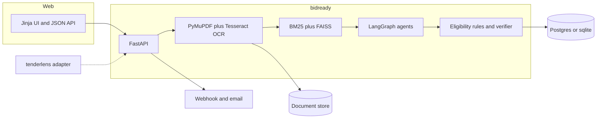
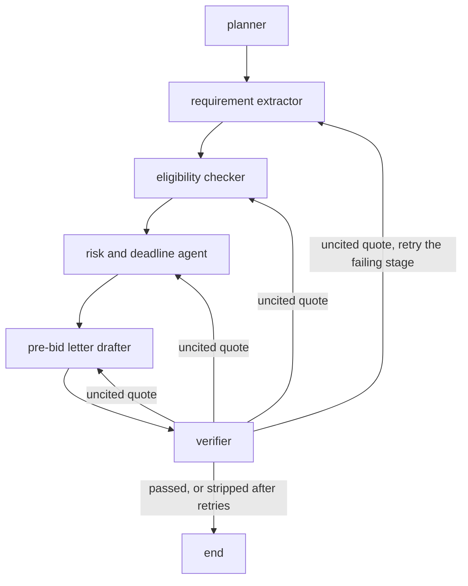
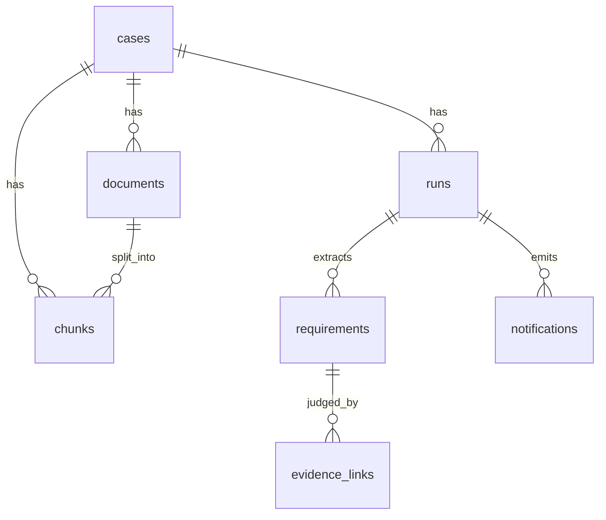

# bidready

Indian MSMEs lose government tenders because a pack runs 100 to 300 pages across scanned PDFs, corrigenda and annexures. Working out eligibility, and which certificate answers which clause, takes days. Consultants charge for that reading.

bidready takes a tender pack plus a company's own documents (GST certificate, turnover statements, past work orders, certifications) and writes four things:

1. A cited go / no-go eligibility report.
2. A compliance matrix that maps each extracted requirement to the company evidence that satisfies it, or marks it `MISSING`.
3. Risks and key deadlines (EMD, bid due date, pre-bid meeting, liquidated damages).
4. A draft pre-bid query letter.

Every claim cites a clause and a page. The draft is for a person to review. It is not legal advice and it is not a bid recommendation.

This repository is a public resume project. The company files under `src/bidready/synthetic/` are fictional.

## Architecture



The tenderlens adapter is optional. bidready runs with `TENDERLENS_BASE_URL` unset. The sibling crawler at `hiroshi-os/tenderlens` was only a README when this MVP was written, so the adapter speaks a small JSON contract and is not required for any scored path.

## Agent graph



State is a LangGraph `TypedDict`. Each node appends a trace event (`node`, milliseconds, detail). Retries are a dict on the state. A stage may be sent back at most twice. If one stage exceeds that, or the total retries exceed 6, the verifier deletes the unsupported claims and ends. The graph recursion limit is 50.

On the mock plumbing run the verifier passed on the first pass (964 of 964 claims). On the local-model run every stored quote was also a span (143/143 on prompt v1, 145/145 on prompt v2), because a quote that fails the substring test is dropped before it is stored. The retry edge is covered by `tests/test_pipeline.py`, which injects one fabricated quote and checks that the second pass cites a real line.

Mock mode does not call a model. It runs the same graph and applies the cue rules written in `src/bidready/prompts.py`. `openai` and `ollama` call a model for extraction, eligibility, risks and a question note, then fall back to those rules if the call fails or returns nothing. That fallback is recorded in the trace. The LLM path was not scored in the numbers below.

## Data model



| Table | What it stores |
| --- | --- |
| `cases` | One tender review. Status, synthetic `profile_id`, go / no-go. |
| `documents` | Tender or company file, storage URI, page count, OCR page count. |
| `chunks` | Layout chunk with page range, clause, section heading, text. |
| `runs` | Provider, model, embedding, reranker, prompt version, latency, token counts, full report JSON, trace. |
| `requirements` | Extracted clause, kind, quote, page, chunk id. |
| `evidence_links` | Decision (`met`, `not_met`, `missing`, `unclear`), obligation, rationale, evidence quote. |
| `notifications` | Webhook and email rows. `stubbed` when no URL or SMTP host is set. |

sqlite is the default for a laptop and for tests. Postgres is the database in `docker-compose.yml`.

## Design

### Parsing and chunking

Text PDFs are read with PyMuPDF `get_text("dict")` so each visual line stays a line. A page with fewer than 40 alphanumeric characters is rendered at 200 dpi and passed to Tesseract. On this gold set that fired for 8 pages of the 50-page SGGSCC pack and for none of the other nine PDFs.

Headings (`Clause 2. Earnest Money Deposit`, `NOTICE INVITING TENDER`) become the chunk's section and are not glued onto the next requirement. All-caps body text is common in these packs, so a line that contains `should`, `shall`, `rupees` or `lakh` stays in the body. A wrapped amount such as `(GROSS) OF 88 LAKHS` is joined to the line above. A new `BIDDER SHOULD` or `EMD` line is not.

Chunks flush on a page change and around 1000 characters (hard stop 1800). Each chunk keeps `page_start`, `page_end`, a clause number when the line starts with one, and the section heading.

### Retrieval

Four modes share one index:

| Mode | What it does |
| --- | --- |
| `vector` | FAISS `IndexFlatIP` on L2-normalised embeddings (cosine). |
| `bm25` | `rank_bm25` Okapi over word tokens. |
| `hybrid` | Reciprocal rank fusion of the two lists, `k = 60`. |
| `hybrid_rerank` | Fusion pool of up to 30 chunks, then a reranker cuts it to k. |

The default embedder is `hash`: a 384-dimensional feature hash of tokens. It is lexical. It is not a semantic model. It is the default so Docker and CI do not download weights. `EMBEDDING_PROVIDER=sentence-transformers` uses `all-MiniLM-L6-v2` after `uv sync --extra local`. The local-model tables below use that embedder.

The default reranker is character-trigram Jaccard. `RERANKER=cross-encoder` loads `cross-encoder/ms-marco-MiniLM-L-6-v2` from the same local extra. That model is the one in the local-model retrieval table below.

Tradeoff. In-process FAISS avoids a second server. pgvector would be the better index once many tenants share one Postgres. With hash embeddings, fusion beat the vector index and the lexical reranker lowered MRR. With MiniLM embeddings, the ms-marco MiniLM cross-encoder raised MRR above fusion. Both comparisons are in the results.

### Eligibility and the verifier

The checker does not read a hidden profile JSON at decision time. It retrieves company chunks and reads the amount, headcount or certificate sentence it cites.

| Signal in the tender sentence | Decision rule |
| --- | --- |
| Turnover, solvency, net worth | Compare the cited evidence amount with the rupee threshold next to the keyword. A percent of estimated cost is `unclear` when no estimated cost was parsed. |
| Similar works | Parse alternatives such as "3 works of Rs. X" or "THREE SIMILAR WORKS ... 70 LAKHS". |
| GST, PAN, PSARA, ISO | `met` only when a company sentence contains the marker. |
| Blacklist, loss years | `met` when the cited sentence is the negative declaration. |
| EMD, bid security | A submission item. `missing` unless a company sentence cites an instrument. `missing` here is `CONDITIONAL`, not `NO-GO`. |

Go / no-go, which is not a legal opinion: any `not_met` is `NO-GO`. A `missing` qualification is `NO-GO`. A `missing` submission item or any `unclear` row is `CONDITIONAL`. All `met` is `GO`.

On the local-model path the extractor does not see every chunk. It reads up to 24 chunks: a hybrid-rerank pass, then a few chunks from sections whose headings look like eligibility, in batches of 2. The model picks a span id from a menu. The stored quote is that span. `text` is the model's restatement. Eligibility retrieves company chunks per requirement, again hybrid plus the cross-encoder, and the model picks an evidence span id. A missing or invalid span id clears the citation and keeps the decision. A second eval pass shows the rule checker's proposal and is stored separately. Parsed rupee amounts are appended as integers. The model-only pass does not see the rule decision.

The verifier is programmatic. A quote is supported when it has at least 20 characters after whitespace normalisation and is a substring of the cited chunk (exact or whitespace-normalised). Periods in `Rs.` and `Mr.` are not sentence breaks, because splitting there used to drop the amount. The verifier does not ask a model whether a citation "seems" right.

## Eval methodology

Labels live in `evals/gold/manifest.json`, dated 2026-09-25. Ten public tender PDFs. The PDFs are not in git. `python -m evals.cli fetch` downloads them into `data/gold_pdfs/` and checks the sha256 in the manifest.

The label set was read while the heuristic was being written. These scores are not an unbiased estimate on unseen tenders.

| id | pages | source |
| --- | --- | --- |
| barc-ced-2026 | 17 | https://barc.gov.in/tenders/tender265.pdf |
| cci-forensic-2024 | 34 | https://www.cci.gov.in/images/whatsnew/en/nit-dated-24102024-11729760843.pdf |
| epi-1366 | 40 | https://epi.gov.in/admin/image/tenders/1741783038_NIT-1366.pdf |
| epi-1367 | 39 | https://epi.gov.in/admin/image/tenders/1741689388_NIT1367.pdf |
| igidr-travel-2024 | 15 | http://www.igidr.ac.in/tender/2024/TD-09.pdf |
| iiml-website | 17 | https://www.iiml.ac.in/sites/default/files/upload/tender/1620136915IIML_Website.pdf |
| iimtrichy-stp-2024 | 24 | https://www.iimtrichy.ac.in/sites/default/files/upload/14Oct2024193737_2024101419373324SP204T_STPPlant_Final.pdf |
| iitpkd-ambulance-2024 | 13 | https://iitpkd.ac.in/sites/default/files/2024-02/TENDER_DOCUMENT_399.pdf |
| sggscc-civil-2024 | 50 | https://www.sggscc.ac.in/uploads/tenders/tenderDocument/02da0157d53780863da33b98f4c446f0.pdf |
| nhm-dnh-2025 | 25 | https://cdnbbsr.s3waas.gov.in/s371e09b16e21f7b6919bbfc43f6a5b2f0/uploads/2025/11/202511132120554845.pdf |

sha256 values are in the manifest. NHM's first page names the Mission Director, National Health Mission, UT of Dadra & Nagar Haveli, Daman & Diu.

Company profiles `sample-civil` and `sample-security` are synthetic. Both files say so in the first line. GSTINs are fake. Eligibility labels say which profile should be `met`, `not_met`, `missing` or `unclear`.

What is scored:

- Retrieval recall@5, recall@10 and MRR for `vector`, `hybrid` and `hybrid_rerank`. A chunk is relevant when it contains every phrase in the query's `match_all`. 28 queries.
- Requirement extraction. A prediction matches a gold clause when the predicted sentence contains every gold phrase. Micro precision and recall.
- Eligibility accuracy on the labelled clauses, against the two synthetic profiles. 39 labels. The local-model number calls the LLM with rule fallback off. The 39/39 figure is the rule checker.
- Citation faithfulness. Span faithfulness requires every stored tender quote, evidence quote, risk, deadline and letter quote to be a span of the cited chunk. Semantic faithfulness asks `cross-encoder/nli-MiniLM2-L6-H768` whether the span entails the claim (argmax of contradiction, entailment, neutral). Pairs whose two sides are the same string are reported separately, because a sentence entails itself.
- Latency is wall clock around `analyse()` for each tender with `sample-civil`. Token counts are `prompt_eval_count` and `eval_count` from Ollama. Cost was not computed from those counts.

The label file has 70 requirements. Three packs are exhaustive for bidder obligations to possess, hold, or submit: `igidr-travel-2024` (15), `iiml-website` (15), `iitpkd-ambulance-2024` (16). Product specs, portal navigation, and post-award administration are outside that definition. The other seven packs are still a sample (24 requirements). Precision on the exhaustive packs is the figure to read. Precision on all 70 still treats an unlabelled true requirement in a sample pack as a false positive. Eligibility labels were not added for the new requirements, so that set is still 39.

## Results

Two local-model runs, same machine, same gold set. The after run is the one to read. The mock table further down is the pipeline and plumbing baseline from 2026-09-25, on the original 33-clause label set.

Hardware for both runs: Python 3.12.3, Linux 6.12.94+ x86_64, Intel Xeon, 4 CPUs, 15.64 GiB RAM, no swap. Tesseract 5.3.4. Ollama 0.34.4. LLM `qwen2.5:3b` (Q4_K_M), temperature 0, `num_ctx` 4096. Embeddings `sentence-transformers/all-MiniLM-L6-v2`. Reranker `cross-encoder/ms-marco-MiniLM-L-6-v2`. NLI `cross-encoder/nli-MiniLM2-L6-H768`. Rule fallback off. No paid key. Cost was not computed.

| run | date | `num_predict` | what the model saw | file |
| --- | --- | ---: | --- | --- |
| before | started 2026-09-25 22:13 UTC, written 2026-09-26 | 900 | at most 12 chunks, batches of 3; a decision whose evidence quote was not a span was stored as `unclear` | `evals/results/local-3b-2026-09-26-window12.json` |
| after | 2026-09-26 | 700 | up to 24 chunks by section, batches of 2; the model returns a span id; an invalid id clears the citation and keeps the decision | `evals/results/local.json` (copy: `evals/results/local-3b-2026-09-26-span.json`) |

Unrounded values are in those files. Tables below round to three decimals.

### Retrieval (28 queries)

Remeasured in the after run. The unrounded recall@5, recall@10 and MRR match the before run.

| mode | recall@5 | recall@10 | MRR |
| --- | ---: | ---: | ---: |
| vector (MiniLM) | 0.775 | 0.823 | 0.676 |
| hybrid (MiniLM + BM25) | 0.842 | 0.919 | 0.810 |
| hybrid + ms-marco MiniLM cross-encoder | 0.877 | 0.937 | 0.946 |

### Requirement extraction

A prediction matches when it contains every gold phrase. v1 after predicts 196 sentences against 70 labels, so precision on the seven sample packs counts unlabelled true requirements as false positives. The exhaustive column is the fairer precision.

| run | prompt | scope | predicted | matched | precision | recall | F1 |
| --- | --- | --- | ---: | ---: | ---: | ---: | ---: |
| before | v1 | all 70 | 63 | 24 / 70 | 0.381 | 0.343 | 0.361 |
| after | v1 | all 70 | 196 | 32 / 70 | 0.163 | 0.457 | 0.241 |
| before | v1 | exhaustive 46 | 26 | 15 / 46 | 0.577 | 0.326 | 0.417 |
| after | v1 | exhaustive 46 | 53 | 22 / 46 | 0.415 | 0.478 | 0.444 |
| before | v2 | all 70 | 47 | 14 / 70 | 0.298 | 0.200 | 0.239 |
| after | v2 | all 70 | 20 | 10 / 70 | 0.500 | 0.143 | 0.222 |
| before | v2 | exhaustive 46 | 13 | 6 / 46 | 0.462 | 0.130 | 0.203 |
| after | v2 | exhaustive 46 | 8 | 5 / 46 | 0.625 | 0.109 | 0.185 |

v1 recall rose and precision fell. v2 recall fell. On this model the wider window plus the span menu extracted more under v1, including many sentences that are not in the 70 labels.

### Eligibility

The before number is one model pass. The after run reports two passes. `llm` does not see the rule checker. `hybrid` is shown the rule checker's decision and may agree or override. The rule checker on the same 39 labels is 39/39 in both files.

| run | judge | correct | accuracy | cited | met | not_met | missing | unclear |
| --- | --- | ---: | ---: | ---: | ---: | ---: | ---: | ---: |
| before | llm, quote had to be a span | 5 / 39 | 0.128 |  | 0 / 19 | 0 / 7 | 3 / 10 | 2 / 3 |
| after | llm | 12 / 39 | 0.308 | 32 / 39 | 5 / 19 | 7 / 7 | 0 / 10 | 0 / 3 |
| after | hybrid | 16 / 39 | 0.410 | 39 / 39 | 9 / 19 | 7 / 7 | 0 / 10 | 0 / 3 |

Before, 17 of 19 `met` rows and all 7 `not_met` rows were stored as `unclear`. Two of the five matches were those dropped `unclear` rows. After, every `not_met` row is correct on both passes, and `met` is 5/19 (llm) or 9/19 (hybrid). Every `missing` row was predicted `not_met`. The model picks a span and treats it as a failure instead of saying the span is not about the requirement.

After, llm confusion: `met` to `met` 5, `met` to `not_met` 7, `met` to `missing` 7, `not_met` to `not_met` 7, `missing` to `not_met` 10, `unclear` to `not_met` 2, `unclear` to `met` 1. Hybrid: `met` to `met` 9, `met` to `not_met` 10, `not_met` to `not_met` 7, `missing` to `not_met` 10, `unclear` to `met` 2, `unclear` to `not_met` 1.

A single smoke call before the suite, same model, showed the comparison error on one turnover row: the menu said company 12000000 INR and requirement 3000000 INR, and the model answered `not_met` because it called 12000000 smaller. With the rule pre-screen on that same row it answered `met`. That smoke is not one of the 39 scored rows.

### Citation faithfulness

Span containment after the pipeline drops quotes that are not spans: before v1 143/143, v2 145/145; after v1 387/387, v2 60/60. That rate is the filter.

The headline semantic number is NLI entailment on pairs whose two sides are not the same string.

| run | prompt | non-identical pairs | entailment | rate |
| --- | --- | ---: | ---: | ---: |
| before | v1 | 33 | 7 | 0.212 |
| after | v1 | 298 | 157 | 0.527 |
| before | v2 | 45 | 10 | 0.222 |
| after | v2 | 43 | 13 | 0.302 |

The mix changed. Before, requirement text was a copy of the quote, so those pairs were identical (v1 63/63, v2 47/47) and left out of the headline. The headline was then evidence, risk and deadline. After, requirement `text` is a restatement, so most headline pairs are requirements. After v1 by kind, including identical pairs in the counts: requirements 169/196 entailment (22 identical), evidence 3/103, risk 0/13, deadline 7/8. After v2: requirements 13/20 (2 identical), evidence 2/14, risk 0/11, no deadlines stored. Evidence rationales are usually not entailed by the cited span. Several cited spans are the synthetic banner line ("SYNTHETIC — fictional ... solvency certificate"), which the menu kept because the line contains the word solvency.

Hand check of the first 16 v1 pairs in the after file, on 2026-09-26. Agreement is on whether the span supports the hypothesis (entailment versus not). Agree 14, disagree 2. One disagreement is a loss-year sentence and the restatement "The bidder should not have incurred...", which the NLI model labelled neutral. The other is a span that says BARC reserves the right to forfeit security, restated as "The bidder must forfeit", which the NLI model labelled entailment. The 16 pairs and these two notes are `hand_check` in `evals/results/local.json`. The before hand check (13 agree, 3 disagree, all risk sentences) is in the window-12 file and is not this run.

### Latency and tokens

Wall clock around `analyse()` with `sample-civil`. Tokens are Ollama counts.

| run | prompt | wall clock | prompt tokens | completion tokens |
| --- | --- | ---: | ---: | ---: |
| before | v1 | 3209.7 s | 97783 | 25682 |
| after | v1 | 4000.4 s | 213444 | 31521 |
| before | v2 | 2502.4 s | 88665 | 20301 |
| after | v2 | 1532.1 s | 106965 | 10316 |

After, prompt v1:

| tender | go / no-go | requirements | risks | deadlines | seconds | prompt / completion |
| --- | --- | ---: | ---: | ---: | ---: | --- |
| barc-ced-2026 | NO-GO | 17 | 1 | 2 | 356.3 | 19502 / 2837 |
| cci-forensic-2024 | NO-GO | 16 | 1 | 1 | 338.3 | 19283 / 2757 |
| epi-1366 | NO-GO | 22 | 0 | 0 | 414.6 | 22094 / 3458 |
| epi-1367 | NO-GO | 14 | 4 | 0 | 320.9 | 17616 / 2583 |
| igidr-travel-2024 | NO-GO | 13 | 0 | 2 | 304.2 | 18209 / 2269 |
| iiml-website | NO-GO | 28 | 4 | 3 | 506.2 | 25917 / 4101 |
| iimtrichy-stp-2024 | NO-GO | 19 | 0 | 0 | 380.6 | 21080 / 3047 |
| iitpkd-ambulance-2024 | NO-GO | 12 | 1 | 0 | 301.3 | 17064 / 2308 |
| sggscc-civil-2024 | NO-GO | 25 | 0 | 0 | 518.0 | 24878 / 3927 |
| nhm-dnh-2025 | NO-GO | 30 | 2 | 0 | 560.1 | 27801 / 4234 |

After, prompt v2:

| tender | go / no-go | requirements | risks | deadlines | seconds | prompt / completion |
| --- | --- | ---: | ---: | ---: | ---: | --- |
| barc-ced-2026 | NO-GO | 4 | 0 | 0 | 188.8 | 11846 / 1418 |
| cci-forensic-2024 | NO-GO | 3 | 0 | 0 | 164.5 | 11154 / 1171 |
| epi-1366 | CONDITIONAL | 0 | 0 | 0 | 116.7 | 8313 / 769 |
| epi-1367 | CONDITIONAL | 0 | 2 | 0 | 113.1 | 8736 / 769 |
| igidr-travel-2024 | NO-GO | 1 | 0 | 0 | 162.7 | 10522 / 958 |
| iiml-website | NO-GO | 4 | 2 | 0 | 177.1 | 12054 / 1182 |
| iimtrichy-stp-2024 | NO-GO | 1 | 0 | 0 | 137.5 | 10429 / 837 |
| iitpkd-ambulance-2024 | NO-GO | 3 | 3 | 0 | 157.0 | 11602 / 1119 |
| sggscc-civil-2024 | NO-GO | 2 | 4 | 0 | 157.0 | 11073 / 1049 |
| nhm-dnh-2025 | GO | 2 | 0 | 0 | 157.6 | 11236 / 1044 |

### `qwen2.5:7b-instruct` on the three exhaustive packs

Same day, same hardware, prompt v1 only, span-menu pipeline. Packs: IGIDR travel, IIML website, IIT Palakkad ambulance (46 labels, 12 eligibility rows). File: `evals/results/local-7b-exhaustive.json`. The other seven tenders were not run. `qwen2.5:3b` on those same three packs, from the after file, is the comparison.

| model | predicted | matched | precision | recall | F1 | llm eligibility | hybrid eligibility | wall clock | prompt / completion tokens |
| --- | ---: | ---: | ---: | ---: | ---: | ---: | ---: | ---: | --- |
| `qwen2.5:3b` | 53 | 22 / 46 | 0.415 | 0.478 | 0.444 | 4 / 12 | 6 / 12 | 1111.6 s | 61190 / 8678 |
| `qwen2.5:7b-instruct` | 53 | 23 / 46 | 0.434 | 0.500 | 0.465 | 6 / 12 | 7 / 12 | 1848.6 s | 61429 / 6220 |

7B seconds: IGIDR 611.7, IIML 744.2, IIT Palakkad 492.7. Span filter 111/111. NLI headline 53/86 (0.616). By kind, including identical pairs: requirements 44/53 entailment (0 identical), evidence 5/18 (2 identical), risk 0/10, deadline 6/7. On the 12 eligibility rows the 7B model-only pass got one `missing` correct; the 3B pass on the full 39 did not. The earlier smoke, 7B alone, was 23 generated tokens in 3.6 s (6.39 tokens/second) with 5.61 GiB still available.

### Model table

Eligibility below is the model-only pass, not the hybrid pass.

| setup | measured | precision (all 70) | recall (all 70) | exhaustive precision | exhaustive recall | eligibility |
| --- | --- | ---: | ---: | ---: | ---: | ---: |
| before, `qwen2.5:3b`, prompt v1 | yes, 2026-09-26, hardware above | 0.381 | 0.343 | 0.577 | 0.326 | 5/39 |
| after, `qwen2.5:3b`, prompt v1 | yes, same day, span menu | 0.163 | 0.457 | 0.415 | 0.478 | 12/39 llm, 16/39 hybrid |
| before, `qwen2.5:3b`, prompt v2 | yes | 0.298 | 0.200 | 0.462 | 0.130 | same 5/39 |
| after, `qwen2.5:3b`, prompt v2 | yes | 0.500 | 0.143 | 0.625 | 0.109 | same 12/39 and 16/39 |
| `qwen2.5:7b-instruct`, prompt v1, three exhaustive packs | yes, 2026-09-26, same hardware | not run | not run | 0.434 | 0.500 | 6/12 llm, 7/12 hybrid |
| OpenAI `gpt-4o-mini` | not run. `OPENAI_API_KEY` was unset |  |  |  |  |  |

### Plumbing baseline (mock), 2026-09-25

This is the pipeline with no model call. It is not an LLM quality number. LLM provider `mock`. Embeddings `feature-hash-384`. Reranker `lexical-trigram-jaccard`. Prompt text sha256 prefixes: v1 `20b6de85dd7e`, v2 `2b80157d0c34`. Gold set at that time: 33 selected clauses, 39 eligibility labels. File: `evals/results/mock-baseline.json` (same bytes as `evals/results/measured.json`).

#### Retrieval (28 queries)

| mode | recall@5 | recall@10 | MRR |
| --- | ---: | ---: | ---: |
| vector | 0.536 | 0.607 | 0.519 |
| hybrid | 0.680 | 0.883 | 0.685 |
| hybrid + lexical rerank | 0.608 | 0.854 | 0.525 |

#### Requirement extraction (cue policies, full document, 33 clauses)

| prompt | predicted sentences | labelled clauses matched | precision | recall | F1 |
| --- | ---: | ---: | ---: | ---: | ---: |
| v1 (35 cues) | 549 | 33 / 33 | 0.060 | 1.000 | 0.113 |
| v2 (20 cues, modal required) | 191 | 30 / 33 | 0.157 | 0.909 | 0.268 |

These precisions are on the 33-clause sample. They are not comparable to the 70-label local-model precisions above.

The same cue extractor, re-run on 2026-09-26 against the widened 70 labels while the local stack was scoring retrieval, matched 48/70 (v1, precision 0.087, recall 0.686) and 40/70 (v2, precision 0.209, recall 0.571). That is `heuristic_extraction` in `local.json`. It is still the cue list, not `qwen2.5:3b`.

#### Eligibility and span faithfulness

Rule checker 39/39 on the synthetic profiles. Confusion is the diagonal: `met` 19, `missing` 10, `not_met` 7, `unclear` 3. Span faithfulness on the full mock pipeline 964/964. Prompt tokens 0 and completion tokens 0. Cost was not measured.

| tender | go / no-go | requirements | risks | deadlines | seconds | claims supported |
| --- | --- | ---: | ---: | ---: | ---: | --- |
| barc-ced-2026 | NO-GO | 67 | 24 | 3 | 0.200 | 124 / 124 |
| cci-forensic-2024 | CONDITIONAL | 38 | 13 | 0 | 0.170 | 70 / 70 |
| epi-1366 | NO-GO | 100 | 24 | 2 | 0.283 | 148 / 148 |
| epi-1367 | NO-GO | 95 | 24 | 2 | 0.272 | 140 / 140 |
| igidr-travel-2024 | CONDITIONAL | 31 | 24 | 0 | 0.124 | 70 / 70 |
| iiml-website | NO-GO | 55 | 22 | 1 | 0.180 | 95 / 95 |
| iimtrichy-stp-2024 | CONDITIONAL | 41 | 18 | 6 | 0.256 | 87 / 87 |
| iitpkd-ambulance-2024 | CONDITIONAL | 19 | 7 | 1 | 0.119 | 38 / 38 |
| sggscc-civil-2024 | NO-GO | 33 | 12 | 4 | 6.529 | 72 / 72 |
| nhm-dnh-2025 | NO-GO | 70 | 24 | 0 | 0.194 | 120 / 120 |

Total wall clock 8.327 seconds. SGGSCC is the slow one because 8 pages went through OCR. Risks are capped at 24 and deadlines at 16. Verifier `passed` was true on all ten.

## Limits

- This is not legal advice. A human still has to read the pack.
- OCR quality is not labelled. Only the SGGSCC pack needed OCR here (8 of 50 pages). A bad scan will cite the OCR text, including its errors.
- Company profiles are synthetic. There are no real bidders' documents in this repo.
- The gold set is 10 tenders, 70 requirements (46 of them in three exhaustive packs), and 39 eligibility labels. The labels were used while the heuristic and the span-menu prompts were written. The scores are one pass on that development set.
- The local model sees at most 24 chunks, not the whole pack. Extraction recall includes that limit.
- `qwen2.5:7b-instruct` was scored on the three exhaustive packs only (prompt v1). It was not run on the other seven tenders.
- Span faithfulness of 387/387 and 60/60 is the substring filter. The headline semantic number is the non-identical NLI rate. On the after v1 file that rate is 157/298, and most of those pairs are requirement restatements. Evidence rationales are entailed in 3 of 103 pairs. A hand check of 16 pairs agreed on 14.
- Eligibility still misses every `missing` label: the model predicts `not_met`. Banner lines that contain a fact word such as solvency stay on the evidence menu, and the model cites them.
- No paid model was called. Token counts are recorded. Cost was not computed from them.
- Docker Compose was run on 2026-09-26. Docker 29.1.3 and Compose 2.40.3 were installed with apt. The first `docker compose up --build` failed while extracting the Postgres image: overlayfs refused a whiteout file (`operation not permitted` on `etc/alternatives/.wh.pager.1.gz`). A second attempt with `dockerd --storage-driver=vfs` built the app image and started both containers. Postgres 16.15 became healthy and the host could open `127.0.0.1:5432`. The app container exited with `psycopg.errors.ConnectionTimeout` to `db:5432`. A second container on the same bridge also timed out connecting to `db:5432`, so the hostname resolved and the healthcheck had already passed. dockerd logged `Deleting nftables IPv4 rules` with exit status 1. The app did not serve `/health`. That is a VM bridge limitation, not a compose hostname or healthcheck setting. The log excerpt is in `evals/results/docker-compose.txt`.
- GeM hosts (`fulfilment.gem.gov.in`, `bidplus.gem.gov.in`) did not return PDFs from this network (TLS error). They are not in the gold set.
- Webhook, SMTP and S3 are implemented and unconfigured by default. S3 needs `boto3`, which is not a required dependency. tenderlens is optional.

## Run it

Python 3.12, Tesseract, and [uv](https://docs.astral.sh/uv/).

```bash
uv sync --extra dev
cp .env.example .env
uv run bidready
```

Open http://127.0.0.1:8000 , upload a tender PDF, and pick the synthetic profile `sample-civil` or `sample-security`. The case page shows the decision, the matrix, deadlines, risks, the letter and the agent trace. `GET /api/cases/{id}` returns the same report as JSON. `GET /health` shows the providers.

```bash
docker compose up --build
```

Compose is meant to start Postgres 16 and the app on port 8000 in mock / hash / lexical mode. On this VM that command did not reach a healthy app. See the limits and `evals/results/docker-compose.txt`.

```bash
# after the PDFs are fetched
python -m evals.cli fetch
python -m evals.cli check
python -m evals.cli all --embedding hash --reranker lexical --out evals/results/measured.json
python -m evals.cli local --llm-model qwen2.5:3b --prompts v1,v2 --out evals/results/local.json
```

`local` needs Ollama, the `local` extra (`sentence-transformers`), and `HEURISTIC_FALLBACK` is forced off by that command. The scored model in the results is `qwen2.5:3b`.

### Providers

| Variable | Values | Default |
| --- | --- | --- |
| `LLM_PROVIDER` | `mock`, `ollama`, `openai` | `mock` |
| `LLM_MODEL` | empty uses `qwen2.5:7b-instruct` for Ollama and `gpt-4o-mini` for OpenAI | empty |
| `EMBEDDING_PROVIDER` | `hash`, `sentence-transformers` | `hash` |
| `RERANKER` | `lexical`, `cross-encoder` | `lexical` |
| `PROMPT_VERSION` | `v1`, `v2` | `v1` |

Keys are read from the environment only. See `.env.example`. Nothing in the repo is a credential.

Local model mode is Ollama at `OLLAMA_BASE_URL` (default `http://127.0.0.1:11434`). The default model name is `qwen2.5:7b-instruct`. This VM scored the full gold set with `qwen2.5:3b`, which left room for MiniLM and the cross-encoder. `qwen2.5:7b-instruct` was scored on the three exhaustive packs only. Install the local extra with `uv sync --extra local` before switching embeddings or the reranker off the hash / lexical defaults.

### Tests

GitHub Actions installs Tesseract, runs `uv sync --frozen --extra dev`, then `ruff check` and `pytest` with mock / hash / lexical. Tests use sqlite and do not download models.
